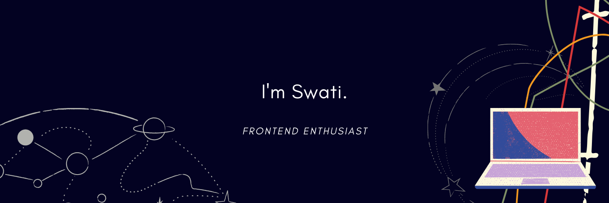

# Hello, I'm Swati

- I'm an Undergrad Student, studying Computer Science Engineering at BMS College of Engineering, Bangalore. (2020 - 2024).
- I work on creating websites, using HTML and CSS, and make them responsive and accessible.
- Participating in #100DaysOfCode since January 01, 2022, aiming to learn Intermediate CSS, Responsive Web Design, JavaScript, Java and many more technologies.

[My Portfolio](https://safirangi.github.io/Portfolio-safirangi/)

   

## Certifications
* [freeCodeCamp's Responsive Web Design](https://www.freecodecamp.org/certification/safirangi/responsive-web-design)
* MATLAB Basics Course: [MatLab Certificate.pdf](https://github.com/Safirangi/Safirangi/files/7883549/MatLab.Certificate.pdf)

### Reach me:

